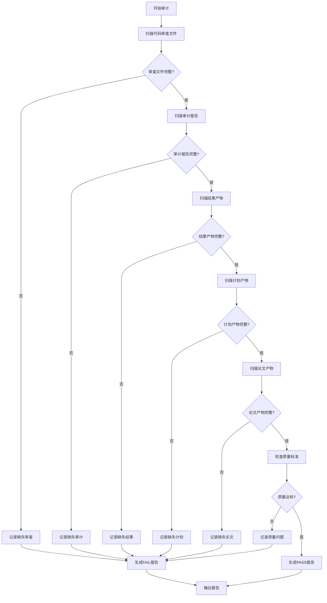

# 完整性审计员（Completeness Auditor）

> **三审计层第二层**：consistency-auditor → completeness-auditor → quality-assurance-auditor
> 三者全部PASS才能提交论文。

## 设计理念

> "每个审查者必须留下磁盘文件。"

本skill是独立的完整性审计层，专注于检查：
- 所有预期的审查文件（*_review.md, *_audit.md）是否存在
- 审查文件是否满足质量标准（如≥5项具体检查）
- 审查文件是否过时（是否在代码修改后更新）
- 工作流产物是否完整

## 执行契约

- **上游输入**：
  - `paper_output/code/` — 代码目录
  - `paper_output/results/` — 结果目录
  - `paper_output/qa/` — QA目录
  - `paper_output/plan/` — 计划目录
  - `.claude/skills/` — Skill目录

- **必须输出**：
  - `paper_output/qa/completeness_audit_report.json` — 审计报告（JSON）
  - `paper_output/qa/completeness_audit_report.md` — 审计报告（人类可读）

- **下游交接**：
  - PASS → 进入 quality-assurance-auditor
  - FAIL → 必须补齐缺失文件后重新审计

## 审计维度

### 1. 代码审查文件完整性

检查每个子问题的代码审查文件：

| 检查项 | 规则 | 严重度 |
|--------|------|--------|
| Python审查存在 | `code/Qx/reviews/qx_python_review.md` 必须存在 | CRITICAL |
| Matlab审查存在 | `code/matlab/Qx/reviews/qx_matlab_review.md` 必须存在（如使用Matlab） | CRITICAL |
| 审查项数量 | 每个审查文件必须有≥5项具体检查 | HIGH |
| 审查引用准确 | 审查项必须引用file:line | HIGH |
| 审查时效性 | 审查时间必须晚于代码最后修改时间 | HIGH |

### 2. 审计报告完整性

检查所有审计报告：

| 检查项 | 规则 | 严重度 |
|--------|------|--------|
| 一致性审计存在 | `qa/consistency_audit_report.json` 必须存在 | CRITICAL |
| 证据门禁存在 | `qa/evidence_gate_report.json` 必须存在 | CRITICAL |
| 格式检查存在 | `qa/format_check_report.json` 必须存在 | HIGH |
| 审计状态通过 | 所有审计报告状态必须为PASS | CRITICAL |

### 3. 结果产物完整性

检查每个子问题的结果产物：

| 检查项 | 规则 | 严重度 |
|--------|------|--------|
| 最终方法解释 | `methods/Qx/qx_final_method_explanation.md` 必须存在 | CRITICAL |
| 最终结果分析 | `results/Qx/reports/qx_final_result_analysis.md` 必须存在 | CRITICAL |
| frozen_numbers | `results/Qx/reports/frozen_numbers.json` 必须存在 | CRITICAL |
| 鲁棒性报告 | `robustness/Qx/qx_robustness_report.md` 必须存在 | HIGH |
| 解决方案包 | `results/Qx/reports/qx_solution_package_for_writer.md` 必须存在 | HIGH |

### 4. 计划产物完整性

检查计划阶段的产物：

| 检查项 | 规则 | 严重度 |
|--------|------|--------|
| 题意分析 | `step1/problem_analysis.json` 必须存在 | CRITICAL |
| 模型路线 | `plan/model_route.json` 必须存在 | CRITICAL |
| 评分对齐 | `plan/rubric_alignment.json` 必须存在 | HIGH |
| 数据计划 | `plan/data_plan.json` 必须存在 | HIGH |
| 图表计划 | `plan/visualization_plan.json` 必须存在 | HIGH |
| 符号表 | `plan/symbol_table.md` 必须存在 | HIGH |
| 论文大纲 | `plan/paper_outline.json` 必须存在 | HIGH |

### 5. 论文产物完整性

检查论文相关产物：

| 检查项 | 规则 | 严重度 |
|--------|------|--------|
| 论文源稿 | `final_paper_source.md` 必须存在 | CRITICAL |
| Word文档 | `final_paper.docx` 必须存在 | CRITICAL |
| 图表索引 | `figure_index.json` 必须存在 | HIGH |
| 表格索引 | `table_index.json` 必须存在 | HIGH |

## 工作流程



## 审计报告格式

### JSON格式

```json
{
  "audit_type": "completeness",
  "audit_time": "2026-06-21T14:35:00+08:00",
  "status": "PASS|FAIL",
  "score": 92,
  "checks": {
    "code_reviews": {
      "status": "PASS",
      "expected": 3,
      "found": 3,
      "quality_passed": 3,
      "details": [
        {
          "file": "code/Q1/reviews/q1_python_review.md",
          "exists": true,
          "check_items": 8,
          "has_file_line_refs": true,
          "is_fresh": true
        }
      ]
    },
    "audit_reports": {
      "status": "PASS",
      "expected": 3,
      "found": 3,
      "all_passed": true
    },
    "result_artifacts": {
      "status": "PASS",
      "expected": 5,
      "found": 5,
      "missing": []
    },
    "plan_artifacts": {
      "status": "WARN",
      "expected": 7,
      "found": 6,
      "missing": ["plan/symbol_table.md"]
    },
    "paper_artifacts": {
      "status": "PASS",
      "expected": 4,
      "found": 4,
      "missing": []
    }
  },
  "failures": [],
  "warnings": [
    {
      "type": "missing_artifact",
      "severity": "HIGH",
      "artifact": "plan/symbol_table.md",
      "suggestion": "运行 symbol-table-builder 生成符号表"
    }
  ]
}
```

### 人类可读格式

```markdown
# 完整性审计报告

**审计时间**: 2026-06-21 14:35:00
**审计状态**: ⚠️ WARN
**综合得分**: 92/100

## 审计摘要

| 维度 | 状态 | 详情 |
|------|------|------|
| 代码审查 | ✅ PASS | 3/3 存在，质量达标 |
| 审计报告 | ✅ PASS | 3/3 存在，全部通过 |
| 结果产物 | ✅ PASS | 5/5 完整 |
| 计划产物 | ⚠️ WARN | 6/7 完整，缺少symbol_table.md |
| 论文产物 | ✅ PASS | 4/4 完整 |

## 缺失文件

### ⚠️ 需要补齐

1. **plan/symbol_table.md** [HIGH]
   - 用途：统一符号表，确保全文符号一致
   - 生成方式：运行 symbol-table-builder skill（该 skill 为纯 agent 驱动，无脚本；符号冲突自动修复可用下方脚本）
   - 命令：`python .claude/skills/quality-assurance-auditor/scripts/auto_correctors/symbol_auto_fixer.py`

## 质量检查

### 代码审查质量

| 文件 | 检查项数 | file:ref | 时效性 |
|------|---------|----------|--------|
| code/Q1/reviews/q1_python_review.md | 8项 | ✅ | ✅ |
| code/Q2/reviews/q2_python_review.md | 6项 | ✅ | ✅ |
| code/Q3/reviews/q3_python_review.md | 5项 | ✅ | ✅ |

### 审计报告状态

| 报告 | 状态 |
|------|------|
| consistency_audit_report.json | ✅ PASS |
| evidence_gate_report.json | ✅ PASS |
| format_check_report.json | ✅ PASS |

## 下一步

- 运行 symbol-table-builder 生成符号表
- 重新运行完整性审计
- 通过后进入 quality-assurance-auditor
```

## 使用方式

### 自动触发

在以下时机自动调用：
- consistency-auditor 通过后
- 论文写作完成后
- 提交前最终检查

### 手动触发

```bash
# 运行完整性审计
python .claude/skills/completeness-auditor/scripts/audit.py

# 指定子问题
python .claude/skills/completeness-auditor/scripts/audit.py --question Q1

# 详细模式
python .claude/skills/completeness-auditor/scripts/audit.py --verbose
```

### Claude Code调用

```
运行完整性审计
检查所有审查文件是否齐全
验证工作流产物完整性
```

## 与其他skill的关系

```
                    ┌─────────────────────┐
                    │  consistency-auditor │
                    └──────────┬──────────┘
                               │ PASS
                               ▼
                    ┌─────────────────────┐
                    │ completeness-auditor │ ← 你在这里
                    └──────────┬──────────┘
                               │ PASS
                               ▼
                    ┌─────────────────────┐
                    │quality-assurance-auditor│
                    └──────────┬──────────┘
                               │ PASS
                               ▼
                    ┌─────────────────────┐
                    │    最终提交          │
                    └─────────────────────┘
```

## 检查清单

### 必须存在的文件

```
paper_output/
├── step1/
│   └── problem_analysis.json           # CRITICAL
├── plan/
│   ├── model_route.json                # CRITICAL
│   ├── rubric_alignment.json           # HIGH
│   ├── data_plan.json                  # HIGH
│   ├── visualization_plan.json         # HIGH
│   ├── symbol_table.md                 # HIGH
│   └── paper_outline.json              # HIGH
├── code/
│   └── Qx/
│       └── reviews/
│           └── qx_python_review.md     # CRITICAL (≥5项检查)
├── methods/
│   └── Qx/
│       └── qx_final_method_explanation.md  # CRITICAL
├── results/
│   └── Qx/
│       └── reports/
│           ├── qx_final_result_analysis.md  # CRITICAL
│           ├── frozen_numbers.json           # CRITICAL
│           └── qx_solution_package_for_writer.md  # HIGH
├── robustness/
│   └── Qx/
│       └── qx_robustness_report.md     # HIGH
├── qa/
│   ├── consistency_audit_report.json   # CRITICAL
│   ├── evidence_gate_report.json       # CRITICAL
│   └── format_check_report.json        # HIGH
├── figure_index.json                   # HIGH
├── table_index.json                    # HIGH
├── final_paper_source.md               # CRITICAL
└── final_paper.docx                    # CRITICAL
```

## 约束

- 本skill**只做审计，不做修改**
- 审计失败时**强制阻塞**，不能跳过
- 审计报告必须落盘，不能只在对话中口头报告
- 缺失文件必须明确指出生成方式
- 质量检查基于文件内容，不只是文件存在性

## 版本历史

- v1.0.0 (2026-06-21): 初始版本，基于zhnnky329/MathModeling-skills设计理念