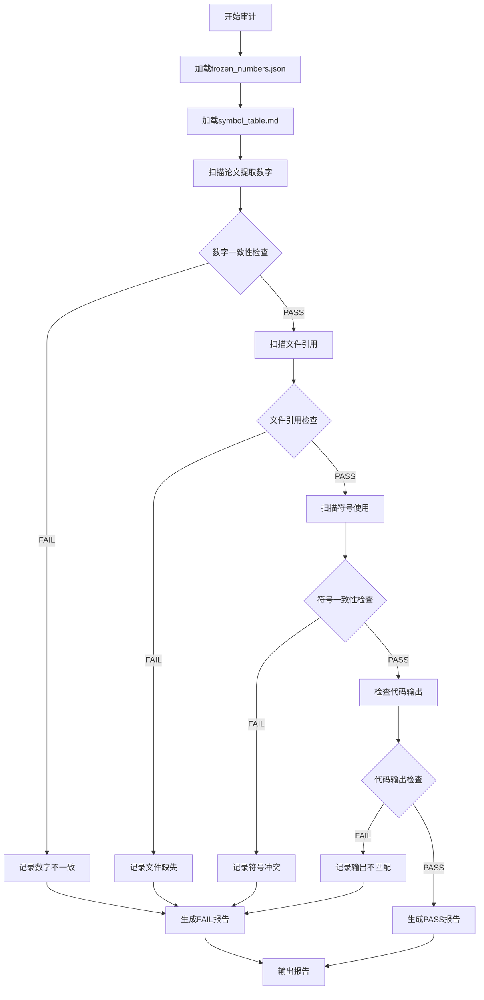

# 一致性审计员（Consistency Auditor）

> **三审计层第一层**：consistency-auditor → completeness-auditor → quality-assurance-auditor
> 三者全部PASS才能提交论文。

## 设计理念

> "每个数字必须追溯到一个冻结快照。"

本skill是独立的一致性审计层，专注于检查：
- 论文中的每个数字是否与 `frozen_numbers.json` 一致
- 论文引用的文件名是否真实存在于磁盘
- 论文使用的符号是否与 `symbol_table.md` 一致
- 代码输出的数字是否与论文描述一致

## 执行契约

- **上游输入**：
  - `paper_output/final_paper_source.md` — 论文源稿
  - `paper_output/results/*/frozen_numbers.json` — 冻结数字
  - `paper_output/plan/symbol_table.md` — 统一符号表
  - `paper_output/code/` — 代码目录
  - `paper_output/figures/` — 图表目录
  - `paper_output/tables/` — 表格目录

- **必须输出**：
  - `paper_output/qa/consistency_audit_report.json` — 审计报告（JSON）
  - `paper_output/qa/consistency_audit_report.md` — 审计报告（人类可读）

- **下游交接**：
  - PASS → 进入 completeness-auditor
  - FAIL → 必须修复后重新审计

## 审计维度

### 1. 数字一致性（核心）

检查论文中的每个数值声明：

| 检查项 | 规则 | 严重度 |
|--------|------|--------|
| 数字存在性 | 论文中的数字必须在frozen_numbers.json中有对应条目 | CRITICAL |
| 数字值匹配 | 论文数字值必须与frozen值在容差范围内一致（默认5%） | CRITICAL |
| 数字来源追溯 | 每个数字必须有source_file和source_locator | HIGH |
| 冻结时效性 | frozen_at必须晚于所有code_source_files的mtime | HIGH |

### 2. 文件引用一致性

检查论文中引用的所有文件：

| 检查项 | 规则 | 严重度 |
|--------|------|--------|
| 图表存在性 | "见图X"引用的图表文件必须存在 | CRITICAL |
| 表格存在性 | "见表X"引用的表格文件必须存在 | CRITICAL |
| 图表编号连续 | 图表编号必须连续，无跳号 | MEDIUM |
| 图表标题匹配 | 论文描述与图表标题语义一致 | MEDIUM |

### 3. 符号一致性

检查论文中使用的所有数学符号：

| 检查项 | 规则 | 严重度 |
|--------|------|--------|
| 符号定义存在 | 使用的符号必须在symbol_table.md中有定义 | HIGH |
| 符号含义一致 | 同一符号在全文中含义一致 | CRITICAL |
| 符号无冲突 | 不同概念不能使用相同符号 | HIGH |
| 符号格式规范 | 向量用粗体，矩阵用大写粗体等 | LOW |

### 4. 代码输出一致性

检查代码实际输出与论文描述：

| 检查项 | 规则 | 严重度 |
|--------|------|--------|
| 结果文件存在 | 论文引用的结果文件必须存在 | CRITICAL |
| 指标值匹配 | 论文中的指标值必须与metrics.json一致 | CRITICAL |
| 结论可追溯 | 论文结论必须与conclusions.json对应 | HIGH |

## 工作流程



## 审计报告格式

### JSON格式

```json
{
  "audit_type": "consistency",
  "audit_time": "2026-06-21T14:30:00+08:00",
  "status": "PASS|FAIL",
  "score": 95,
  "checks": {
    "number_consistency": {
      "status": "PASS",
      "total": 15,
      "matched": 15,
      "mismatched": 0,
      "missing": 0
    },
    "file_reference": {
      "status": "PASS",
      "total": 12,
      "found": 12,
      "missing": 0
    },
    "symbol_consistency": {
      "status": "FAIL",
      "total": 25,
      "consistent": 23,
      "conflicts": 2,
      "details": [
        {
          "symbol": "α",
          "issue": "在Q1中表示权重，在Q3中表示学习率",
          "locations": ["line 45", "line 128"]
        }
      ]
    },
    "code_output": {
      "status": "PASS",
      "total": 8,
      "matched": 8,
      "mismatched": 0
    }
  },
  "failures": [],
  "warnings": [
    {
      "type": "symbol_conflict",
      "severity": "HIGH",
      "message": "符号α在不同子问题中含义不同",
      "location": "line 45, line 128",
      "suggestion": "为Q3的学习率使用不同符号（如η或lr）"
    }
  ]
}
```

### 人类可读格式

```markdown
# 一致性审计报告

**审计时间**: 2026-06-21 14:30:00
**审计状态**: ⚠️ FAIL
**综合得分**: 95/100

## 审计摘要

| 维度 | 状态 | 详情 |
|------|------|------|
| 数字一致性 | ✅ PASS | 15/15 匹配 |
| 文件引用 | ✅ PASS | 12/12 存在 |
| 符号一致性 | ❌ FAIL | 23/25 一致，2个冲突 |
| 代码输出 | ✅ PASS | 8/8 匹配 |

## 发现的问题

### ❌ 必须修复

无

### ⚠️ 建议修复

1. **符号α冲突** [HIGH]
   - 位置：line 45, line 128
   - 问题：在Q1中表示权重，在Q3中表示学习率
   - 建议：为Q3的学习率使用不同符号（如η或lr）

## 下一步

- 修复上述符号冲突后重新审计
- 通过后进入 completeness-auditor
```

## 使用方式

### 自动触发

在以下时机自动调用：
- 论文写作完成后
- 代码修复后重新运行前
- 提交前最终检查

### 手动触发

```bash
# 运行一致性审计
python .claude/skills/consistency-auditor/scripts/audit.py

# 指定论文路径
python .claude/skills/consistency-auditor/scripts/audit.py --paper paper_output/final_paper_source.md

# 严格模式（不容差）
python .claude/skills/consistency-auditor/scripts/audit.py --strict
```

### Claude Code调用

```
运行一致性审计
检查论文数字与代码输出的一致性
验证frozen_numbers.json
```

## 与其他skill的关系

```
                    ┌─────────────────────┐
                    │   paper-formal-writer │
                    └──────────┬──────────┘
                               │
                               ▼
                    ┌─────────────────────┐
                    │  consistency-auditor │ ← 你在这里
                    └──────────┬──────────┘
                               │ PASS
                               ▼
                    ┌─────────────────────┐
                    │ completeness-auditor │
                    └──────────┬──────────┘
                               │ PASS
                               ▼
                    ┌─────────────────────┐
                    │quality-assurance-auditor│
                    └──────────┬──────────┘
                               │ PASS
                               ▼
                    ┌─────────────────────┐
                    │    最终提交          │
                    └─────────────────────┘
```

## 约束

- 本skill**只做审计，不做修改**
- 审计失败时**强制阻塞**，不能跳过
- 审计报告必须落盘，不能只在对话中口头报告
- 数字容差默认5%，可通过参数调整
- 符号检查基于symbol_table.md，如不存在则跳过符号维度

## 配置

```json
{
  "tolerance": {
    "number": 0.05,
    "percentage": 0.10
  },
  "checks": {
    "number_consistency": true,
    "file_reference": true,
    "symbol_consistency": true,
    "code_output": true
  },
  "severity": {
    "block_on_critical": true,
    "block_on_high": false
  }
}
```

## 版本历史

- v1.0.0 (2026-06-21): 初始版本，基于zhnnky329/MathModeling-skills设计理念

## 新增脚本（v4.2）

| 脚本 | 用途 | 触发 |
|------|------|------|
| `scripts/security_check.py` | 安全检查：密钥扫描 + 路径遍历防护 + 环境变量泄露 + Markdown 注入防护 | "安全检查" / "密钥扫描" / "注入防护" |

子命令 `path`/`env`/`scan`/`markdown`/`all`。配合 `.claude/hooks/precommit_secret_guard.py`（已接入 settings.json）在 git commit 前自动拦截密钥。