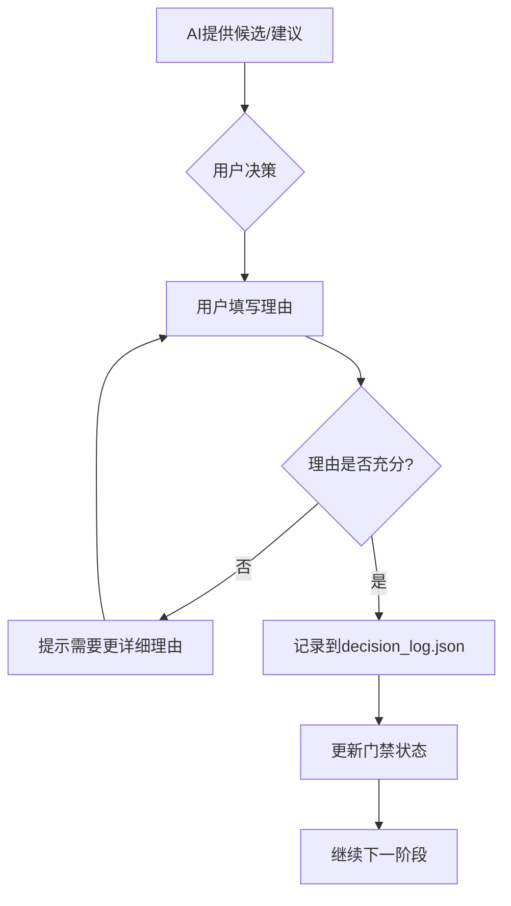

# 决策日志记录器（Decision Logger）

> "AI owns mechanical correctness; the user owns modeling judgment."

## 设计理念

本skill记录用户在建模过程中的关键决策，确保：
- 每个"为什么选这个方法"都能追溯到用户的原始判断
- AI不能代替用户写决策理由
- 决策历史可审计、可追溯

## 执行契约

- **触发时机**：
  - 选模阶段（Gate G2.5）：用户选择候选方法后
  - 结果判断阶段（Gate G4.5）：用户确认结果和稳定性后
  - 任何用户主动要求记录决策时

- **必须输出**：
  - `paper_output/qa/decision_log.json` — 决策日志（追加写入）

- **下游交接**：
  - 决策日志被 `consistency-auditor` 检查
  - 论文中的"为什么选这个方法"必须追溯到此日志

## 决策点

### Gate G2.5: 方法选择决策

**时机**：`method-selector` 提供候选方法后，用户做出选择

**必须记录**：
```json
{
  "gate": "G2.5",
  "step": "method_selection",
  "question": "Q1",
  "timestamp": "2026-06-21T14:30:00+08:00",
  "candidates": [
    {"name": "熵权TOPSIS", "poc_status": "PASS", "score": 0.92},
    {"name": "AHP-TOPSIS", "poc_status": "PASS", "score": 0.88},
    {"name": "模糊综合评价", "poc_status": "FAIL", "score": null}
  ],
  "decision": "熵权TOPSIS",
  "reason": "数据为多指标评价问题，熵权法可客观赋权，避免主观偏见。AHP需要专家打分，本题无此数据。",
  "source": "user",
  "ai_suggestion": "AHP-TOPSIS（基于常见模式）",
  "user_overrode_ai": true
}
```

### Gate G4.5: 结果判断决策

**时机**：`robustness-checker` 完成后，用户确认结果

**必须记录**：
```json
{
  "gate": "G4.5",
  "step": "result_verification",
  "question": "Q1",
  "timestamp": "2026-06-21T15:45:00+08:00",
  "key_results": {
    "main_score": 0.92,
    "sensitivity": "±5%参数变化导致结果变化<3%",
    "baseline_comparison": "优于AHP-TOPSIS 8.7%"
  },
  "decision": "ACCEPT",
  "reason": "结果稳定，灵敏度分析显示模型对参数不敏感，优于基线方法。",
  "source": "user",
  "concerns": []
}
```

### 其他决策点

| 决策点 | 时机 | 记录内容 |
|--------|------|---------|
| 问题拆解确认 | problem-parser完成后 | 用户确认子问题划分 |
| 数据清洗确认 | data-auditor-cleaner完成后 | 用户确认清洗方案 |
| 图表选择确认 | figure-table-planner完成后 | 用户确认图表类型 |
| 最终提交确认 | quality-assurance-auditor通过后 | 用户确认提交 |

## 工作流程



## 决策日志格式

### JSON格式

```json
{
  "version": "1.0",
  "created_at": "2026-06-21T14:00:00+08:00",
  "decisions": [
    {
      "id": "decision_001",
      "gate": "G2.5",
      "step": "method_selection",
      "question": "Q1",
      "timestamp": "2026-06-21T14:30:00+08:00",
      "candidates": [...],
      "decision": "熵权TOPSIS",
      "reason": "...",
      "source": "user",
      "ai_suggestion": "...",
      "user_overrode_ai": true
    }
  ],
  "metadata": {
    "total_decisions": 5,
    "user_overrode_ai_count": 2,
    "last_updated": "2026-06-21T16:00:00+08:00"
  }
}
```

### 人类可读格式

```markdown
# 决策日志

**创建时间**: 2026-06-21 14:00:00
**总决策数**: 5
**用户覆盖AI建议**: 2次

## 决策历史

### 1. Q1方法选择 (G2.5) - 2026-06-21 14:30

**候选方法**:
- 熵权TOPSIS (PoC: ✅, 得分: 0.92)
- AHP-TOPSIS (PoC: ✅, 得分: 0.88)
- 模糊综合评价 (PoC: ❌)

**用户决策**: 熵权TOPSIS
**决策理由**: 数据为多指标评价问题，熵权法可客观赋权，避免主观偏见。AHP需要专家打分，本题无此数据。
**AI建议**: AHP-TOPSIS
**是否覆盖AI**: ✅ 是

### 2. Q1结果确认 (G4.5) - 2026-06-21 15:45

**关键结果**:
- 主得分: 0.92
- 灵敏度: ±5%参数变化导致结果变化<3%
- 基线对比: 优于AHP-TOPSIS 8.7%

**用户决策**: ACCEPT
**决策理由**: 结果稳定，灵敏度分析显示模型对参数不敏感，优于基线方法。
**用户关切**: 无
```

## 使用方式

### 自动触发

在以下时机自动调用：
- 用户选择候选方法后
- 用户确认结果后
- 用户主动要求记录决策时

### 手动触发

```bash
# 记录方法选择决策
python .claude/skills/decision-logger/scripts/log.py --gate G2.5 --question Q1 --decision "熵权TOPSIS" --reason "..."

# 记录结果确认决策
python .claude/skills/decision-logger/scripts/log.py --gate G4.5 --question Q1 --decision ACCEPT --reason "..."

# 查看决策日志
python .claude/skills/decision-logger/scripts/log.py --show
```

### Claude Code调用

```
记录我的决策：选择熵权TOPSIS，理由是...
查看决策日志
```

## 与其他skill的关系

```
                    ┌─────────────────────┐
                    │   method-selector    │
                    └──────────┬──────────┘
                               │ 候选方法
                               ▼
                    ┌─────────────────────┐
                    │   decision-logger    │ ← 你在这里（Gate G2.5）
                    └──────────┬──────────┘
                               │ 决策记录
                               ▼
                    ┌─────────────────────┐
                    │ model-code-generator │
                    └──────────┬──────────┘
                               │
                               ▼
                    ┌─────────────────────┐
                    │ robustness-checker   │
                    └──────────┬──────────┘
                               │
                               ▼
                    ┌─────────────────────┐
                    │   decision-logger    │ ← Gate G4.5
                    └──────────┬──────────┘
                               │
                               ▼
                    ┌─────────────────────┐
                    │  consistency-auditor │
                    └─────────────────────┘
```

## 门禁检查

### Gate G2.5 检查项

- [ ] decision_log.json 存在
- [ ] 包含当前子问题的方法选择决策
- [ ] 决策理由≥50字
- [ ] 理由不是AI生成的模板文本
- [ ] 理由包含具体的数据/问题特征分析

### Gate G4.5 检查项

- [ ] decision_log.json 存在
- [ ] 包含当前子问题的结果确认决策
- [ ] 决策理由≥30字
- [ ] 理由不是简单的"同意"或"可以"
- [ ] 如果有concerns，必须记录具体问题

## 约束

- 决策必须由用户填写，AI不能代写
- 决策理由不能为空或过于简短
- 决策日志只能追加，不能修改历史记录
- 决策日志被consistency-auditor检查
- 论文中的决策理由必须能追溯到此日志

## 版本历史

- v1.0.0 (2026-06-21): 初始版本，基于zhnnky329/MathModeling-skills设计理念

## 新增脚本与文档（v4.2）

| 资产 | 用途 | 触发 |
|------|------|------|
| `scripts/parse_hil_action.py` | 解析 human_intervention.md 的 HIL 6 动作标记（confirm/edit/regenerate/ask/skip/abort） | "解析审查动作" / pipeline rework 时 |
| `references/hil_6_actions.md` | HIL 6 动作协议文档（与 G2.5/G4.5 关系、注入防护） | 设计参考 |

融合自 jihe520。扩展原有 G2.5/G4.5 两门（确认型）为 6 种决策动作，配合 pipeline_manager.py 的 pending_review 状态。