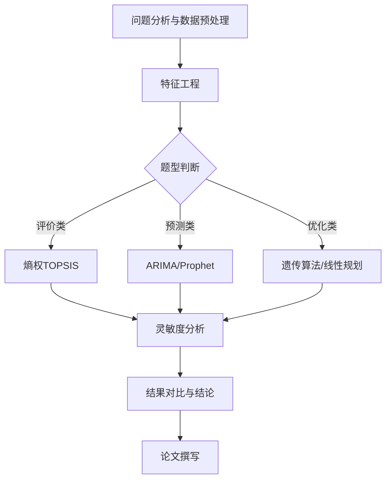

# Diagram Maker — 流程图/架构图生成器

> **此 skill 是 `/figure` 统一入口的内部调度工具。** 用户说"流程图""架构图""画个图"等均由 `/figure` 统一接收后分派到本 skill。本 skill 保留独立触发词仅用于向后兼容。

数学建模论文必备的流程图生成工具。

## 触发词

以下触发词会先由 `/figure` 统一入口接收，然后分派到本 skill：
`流程图` `架构图` `方法框架` `算法步骤` `模型流程` `画个图`

## ★ 项目知识资产联动
本 skill 执行时，**必须**读取以下 `outputs/` 中已沉淀的规则：

| 资产 | 路径 | 用途 |
|------|------|------|
| 图表模板 | `outputs/figure_templates.md` | 流程图/架构图模板 |
| 可视化策略 | `outputs/visualization_strategy_library.md` | 图表方案库 |
| 图表教程 | `resources/06_图表教程/` | 炫酷图表教程 |

## 图表类型

### 1. 模型求解流程图（最常用）
论文第一章末尾的标准配置，展示从问题到结论的完整路径。

### 2. 算法步骤图
展示具体算法的执行流程（如遗传算法的交叉→变异→选择循环）。

### 3. 方法架构图
展示多模型组合的架构（如主模型+辅助模型+验证模型的关系）。

### 4. 数据流向图
展示数据从输入到输出的处理管道。

## 工作流

### Step 1: 确定图表类型

根据用户描述判断需要哪种图。

### Step 2: 选择后端

- **Mermaid**：快速预览，嵌入 Markdown，适合迭代设计
- **matplotlib**：出版级质量，嵌入 Word，适合最终版

### Step 3: 生成代码

#### Mermaid 示例（模型求解流程图）


#### matplotlib 示例（出版级流程图）
```python
import matplotlib.pyplot as plt
import matplotlib.patches as mpatches

def draw_flowchart():
    fig, ax = plt.subplots(1, 1, figsize=(14, 8))
    ax.set_xlim(0, 14)
    ax.set_ylim(0, 8)
    ax.axis('off')

    # 定义节点
    boxes = [
        (7, 7, '问题分析与数据预处理', '#4ECDC4'),
        (7, 5.5, '特征工程与模型选择', '#45B7D1'),
        (3, 4, '评价模型', '#96CEB4'),
        (7, 4, '预测模型', '#FFEAA7'),
        (11, 4, '优化模型', '#DDA0DD'),
        (7, 2.5, '灵敏度分析', '#FF6B6B'),
        (7, 1, '结论与论文', '#2ECC71'),
    ]

    for x, y, text, color in boxes:
        bbox = dict(boxstyle='round,pad=0.3', facecolor=color, edgecolor='#333333', linewidth=1.5)
        ax.text(x, y, text, ha='center', va='center', fontsize=11, fontweight='bold', bbox=bbox)

    # 箭头连接
    arrows = [(7,6.7,7,5.8), (7,5.2,3,4.3), (7,5.2,7,4.3), (7,5.2,11,4.3),
              (3,3.7,7,2.8), (7,3.7,7,2.8), (11,3.7,7,2.8), (7,2.2,7,1.3)]
    for x1,y1,x2,y2 in arrows:
        ax.annotate('', xy=(x2,y2), xytext=(x1,y1),
                    arrowprops=dict(arrowstyle='->', color='#333333', lw=1.5))

    plt.tight_layout()
    plt.savefig('paper_output/figures/methodology_flowchart.png', dpi=300, bbox_inches='tight')
```

### Step 4: 输出

- Mermaid：输出到论文源稿 `.md` 文件中
- matplotlib：输出到 `paper_output/figures/` 目录
- 更新 `paper_output/figures/figure_index.json`

## 约束

- 流程图不超过 10 个节点（保持清晰）
- 使用统一配色（与论文其他图表一致）
- 中文标签，字号 ≥ 10pt
- 箭头方向明确，无交叉